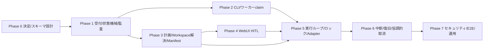

# Task Agent 実装プラン

Status: Draft (implementation plan, not started)

この文書は [specification.md](specification.md) を実リポジトリ構成へ落とすための実装プランである。
仕様を上書きしない。仕様書 §16 の未決事項は decision gate (§10) として扱い、
勝手に確定しない。工数・日程は根拠がないため記載しない。

## 1. 目的と実装原則

- 仕様の受入基準 (specification.md §18) を満たすことを完了条件とする。
- 既存規約に従う: モジュールは `src/obsidian_ai_hub/` 直下を薄い CLI ラッパーにし、
  ロジックはサブパッケージへ置く (AGENTS.md)。
- 既存の失敗を隠す防御的例外処理を導入しない (AGENTS.md)。
- DB を書く作業は `docs/testing.md` の分離方針 (`uv run pytest tests/`) に従い、
  本番 DB を使わない。
- 仕様で否定された機能 (一律実行上限、自動ロールバック、自動再実行、スナップショット一致保証) は
  実装しない。
- 将来入口 (Inbox・定期実行) のために受付サービスを入口から分離した層として作る
  (specification.md §15)。

## 2. 現在利用できる既存基盤

実リポジトリを再調査した結果、以下が存在する。

| 基盤 | 実装 | Task Agent での使い方 |
| --- | --- | --- |
| SQLite とマイグレーション | `src/obsidian_ai_hub/database.py` — `get_db_connection`、`run_migration_vN`、`PRAGMA user_version` (現行 v43) | タスク系テーブルを新 migration (v44 以降) で追加 |
| Project / `project_path` | `database.py` v9 `projects` テーブル、`web/services/projects.py`、`coding/backend.py` の `validate_git_repo` / `check_dirty_tree` | Workspace 解決と Git ルート正規化に再利用 |
| HITL | `hitl/` (`service.py` の `register_run_and_questions` / `claim_run` / `cancel_run`、`store.py`、`types.py`、`dispatcher.py`、`worker.py`)、DB v13/15 | HITL Request の格納・回答・取消を再利用 |
| 常駐ワーカー / run recovery | `runs/manager.py` (`startup_recovery` / `shutdown_recovery`)、`runs/instance.py` (`RunWorkerLock`, `get_instance_id`)、`runs/agent_worker.py` / `runs/coding_worker.py`、launchd (`--hitl-worker`) | 常駐ワーカーと中断 (`interrupted`) 処理の方針を踏襲 |
| coding CLI 連携 | `coding/backend.py` (Codex/OpenCode 起動、cancel_event)、`coding/store.py` (状態機械・イベント)、`runs/coding_worker.py` | 委譲先 Adapter (coding_cli) の実装基盤 |
| 専門エージェント | `agents/` (`registry.py`、`runtime.py`、`service.py`、`store.py`、`ask_user.py`)、DB v21+ `agents` / `agent_runs` | 委譲先 Adapter (specialist_agent) の実装基盤候補 |
| WebUI | `web/app.py`、`web/routes/` (FastAPI)、`web/services/`、`frontend/` (React + Vite) | タスク受信箱・詳細画面の追加先 |
| テスト分離 | `tests/conftest.py`、`src/obsidian_ai_hub/testing/seed.py` | DB 書込みテストの分離とシード |

既存の `task_state` テーブル (v19) は定期コマンド集計用であり、Task Agent の Task とは別物である
(仕様書 §16.2)。名前衝突に注意すること。

## 3. フェーズ分割と依存関係

- Phase 1 が基盤 (受付サービス・状態機械・監査イベント)。
- Phase 2 と Phase 4 は Phase 1 にのみ依存し、並行して進められる。
- Phase 5 は Phase 2〜4 の契約が揃ってから着手する。
- Phase 6 は実行ループの実績があると検証しやすいが、`interrupted` 処理自体は Phase 2 から
  予備実装してよい。

## 4. 各フェーズ

### Phase 0: 未決事項の決定とスキーマ設計

- **目的**: 実装前に仕様書 §16 の未決事項を決定し、マイグレーション設計を固める。
- **変更対象候補**: `database.py` (新 migration)、`config/config.example.yml`
  (コマンド名が決まれば CLI 設定)。
- **実装項目**:
  - decision gates (§10) の各項目を決定し、仕様書 §16 を更新する。
  - specification.md §17 の概念モデルを DDL 素案へ落とす (テーブル名・インデックス・FK)。
- **前提・依存**: なし。
- **完了条件**: 仕様書 §16 が「決定済み」または「MVP で未決のまま受容」として更新されている。
  DDL 素案がレビュー済み。
- **必要なテスト**: なし (設計レビュー)。

### Phase 1: Task 受付サービス、SQLite モデル、状態機械、監査イベント

- **目的**: タスクの永続化・状態遷移・監査の核を作る。
- **変更対象候補**: 新規サブパッケージ `src/obsidian_ai_hub/tasks/`
  (`store.py` 状態機械・永続化、`events.py` Trace Event、`service.py` 受付サービス)、
  `database.py` (新 migration)。
- **実装項目**:
  - `tasks` / `task_plans` / `task_events` / `task_artifacts` 等のテーブル作成。
  - §13.1 の許可遷移表に基づく遷移検証 (表外遷移の拒否)。
  - Trace Event の追記 API と redact フック。
- **前提・依存**: Phase 0。
- **完了条件**: 受付 API がタスクを `queued` で登録でき、許可遷移のみ通過し、
  遷移ごとに Trace Event が記録される。
- **必要なテスト**: 状態遷移単体テスト (全許可遷移・代表禁止遷移)、redact 単体テスト、
  migration テスト。

### Phase 2: CLI 投入契約と常駐ワーカー claim

- **目的**: CLI から投入し、常駐ワーカーが claim できるようにする。
- **変更対象候補**: `src/obsidian_ai_hub/__main__.py` (CLI フラグ追加。仮称 `--task`)、
  `tasks/` (ワーカー claim ロジック)、launchd 関連 (`install.sh`、Makefile)。
- **実装項目**:
  - CLI 投入契約 (specification.md §4): 即時返却 (task_id / `queued` / WebUI URL)。
  - ワーカーの claim (`queued` → `planning`)、インスタンスロック (`runs/instance.py` 流用)。
- **前提・依存**: Phase 1。WebUI URL のパス (decision gate) が確定していること。
- **完了条件**: CLI 投入が即時返却し、ワーカーが claim して `planning` へ進む。
- **必要なテスト**: CLI 単体テスト (返却形式・空入力エラー)、claim の二重実行防止テスト。

### Phase 3: 計画生成、Workspace 解決、Capability Manifest

- **目的**: オーケストレーターの計画フェーズと対象解決を作る。
- **変更対象候補**: `tasks/` (`planning.py` 計画生成、`workspace.py` 解決・正規化)、
  `tasks/capabilities.py` (Manifest 登録・参照)、既存 `coding/backend.py` の再利用。
- **実装項目**:
  - 計画生成 (§7.1 の必須項目) と `task_plans` への版管理保存。
  - Workspace 解決規則 (§8.1): Vault / 有効 `project_path` の確定済み Project /
    曖昧時は HITL 質問へフォールバック。
  - Capability Manifest モデル (`capabilities` テーブル、リトライ方針を含む)。
- **前提・依存**: Phase 1。Manifest 保存形式 (decision gate) の決定。
- **完了条件**: 曖昧な依頼が勝手に実行されず質問になる。無効な `project_path` が対象外になる。
- **必要なテスト**: 解決規則単体テスト (一意/曖昧/対象外)、計画保存の版管理テスト。

### Phase 4: WebUI HITL、承認、差戻し、取消

- **目的**: 人間の関与点 (受信箱・詳細・操作) を提供する。
- **変更対象候補**: 新規 `web/routes/tasks.py`、`web/services/tasks.py`、
  `frontend/src/` (受信箱・詳細画面)、既存 `hitl/service.py` の再利用。
- **実装項目**:
  - 受信箱 (HITL Request 一覧、ポーリング)、タスク詳細 (状態・計画版・トレース・成果物)。
  - 操作: 質問回答、計画承認 (`waiting_approval` → `ready`)、理由必須差戻し
    (`waiting_approval` / `waiting_reapproval` → `planning`)、取消。
  - HITL Request と既存 `hitl_runs` のリンク (`task_hitl_links`)。
- **前提・依存**: Phase 1。Phase 3 の計画表示に必要なデータ構造。
- **完了条件**: 受入基準 §18 の 3〜5 が WebUI から成立する。
- **必要なテスト**: API 結合テスト (回答・承認・差戻し・取消の遷移)、差戻し理由必須のバリデーション
  テスト、フロントエンド単体テスト (モック許容)。

### Phase 5: 実行ループ、ロック、Adapter、委譲

- **目的**: 承認済み計画を実行する。
- **変更対象候補**: `tasks/` (`executor.py` 実行ループ、`locks.py` Workspace ロック)、
  新規 `tasks/adapters/` (`vault.py`、`specialist_agent.py`、`coding_cli.py`)、
  既存 `coding/backend.py` / `agents/runtime.py` の呼出し。
- **実装項目**:
  - 実行ループ (LLM ツール呼出し + 永続状態機械)。
  - Workspace ロック: 書込み排他・読取共有、`waiting_lock` 状態への遷移。
  - 3 種の Adapter と結果の親タスクへの正規化 (状態・成果物・Trace Event)。
  - Manifest 宣言範囲内でのみの自動リトライ。
- **前提・依存**: Phase 2〜4。ロック実装方式 (decision gate) の決定。
- **完了条件**: 受入基準 §18 の 6・8・9 が成立する。
- **必要なテスト**: ロック並行テスト (同一 Workspace 排他・異なる Workspace 並列)、
  Adapter 正規化単体テスト、リトライ宣言範囲テスト。

### Phase 6: 中断・再起動復旧・協調的取消

- **目的**: 停止・再開の完全性を確保する。
- **変更対象候補**: `runs/manager.py` (タスクの recovery 登録)、`tasks/` (`executor.py` の
  cancel_event、interrupted 化)。
- **実装項目**:
  - startup/shutdown recovery による `interrupted` 化 (自動再実行なし)。
  - 協調的取消: 新ステップ開始禁止、実行中ツールへの中止要求、途中変更のトレース記録。
  - 失敗時の実施済み変更・未実施手順・復旧案の記録。
- **前提・依存**: Phase 5。
- **完了条件**: 受入基準 §18 の 7・8 が成立する。
- **必要なテスト**: ワーカー停止シミュレーション (`interrupted` 化・自動再実行されないこと)、
  協調的取消テスト、`cancelling` からの遷移テスト。

### Phase 7: セキュリティ、redaction、E2E、運用確認

- **目的**: 信頼境界と監査の仕上げ。
- **変更対象候補**: `tasks/events.py` (redact 強化)、テスト全般、README / Makefile (運用手順)。
- **実装項目**:
  - 秘密値の redact 検証 (タスク DB・プロンプト・トレース)。
  - 間接プロンプトインジェクションのテスト (Vault/ツール出力中の命令文が実行されないこと)。
  - CLI→WebUI 往復の E2E シナリオ (手動確認。ブラウザ E2E は追加しない方針 — docs/testing.md)。
- **前提・依存**: Phase 6。
- **完了条件**: MVP 完了定義 (§11) を満たす。
- **必要なテスト**: redact 単体テスト、注入耐性テスト、全受入基準の手動確認。

## 5. 状態遷移を中心とするテスト戦略

- 状態機械は単体で検証する: 全 30 遷移 (specification.md §13.1) をパラメータ化テストで通し、
  代表的な禁止遷移 (終端からの遷移、`queued→running`、`interrupted→running`、
  `waiting_approval→running`) が拒否されることを確認する。
- 遷移ごとに Trace Event (`state_transition`) が記録されることをアサートする。
- 状態遷移表・Mermaid 図・テストの 3 者を一致させるため、テストの遷移リストを仕様書から
  手動同期する (自動生成は MVP 外)。

## 6. SQLite migration・並行実行・ロック・クラッシュ復旧の検証戦略

- **migration**: 新 migration 適用後の `PRAGMA user_version` とテーブル存在を migration テストで
  確認。既存 v43 からの連続適用を確認する。
- **並行実行**: 異なる Workspace の 2 タスクが並列に `running` になること、同一 Workspace の
  2 書込みタスクが排他され片方が `waiting_lock` になることを、スレッド/非同期テストで確認する。
- **ロック**: ロック解放後の `waiting_lock → running` 遷移、ロック保持中タスクの取消時に
  待機タスクが進むことを確認する。
- **クラッシュ復旧**: ワーカープロセス終了を模擬し、再起動後 recovery で実行中タスクが
  `interrupted` になり、自動再実行されないことを確認する。二重 claim が起きないことを
  インスタンスロックのテストで確認する。

## 7. WebUI および CLI の E2E シナリオ

ブラウザ E2E は追加しない方針 (docs/testing.md) に従い、以下は手動確認シナリオ + API 結合テスト
でカバーする。

1. CLI 投入 → 即時返却 → WebUI 詳細ページでタスクが `queued` 表示。
2. 曖昧な依頼 → WebUI 受信箱に質問 → 回答 → `planning` 再開。
3. 計画確認 → 承認 → 実行 → `completed` → 結果・トレース・変更一覧の閲覧。
4. 計画確認 → 理由付き差戻し → 再計画 → 再承認 (同一 task_id)。
5. 実行中の取消 → `cancelling` → `cancelled`、途中変更がトレースに残る。
6. ワーカー停止 → `interrupted` → 再起動しても自動実行されない → 人間が再計画指示。

## 8. セキュリティ／信頼境界の検証

- 秘密値 (API キー・トークン・`.env` 値) を入力に含むタスクで、DB・プロンプト・トレースに
  秘密値が現れないことをテストする。
- Vault ノートやツール出力に埋め込んだ命令文が、ユーザー依頼・HITL 回答・システムポリシー以外の
  命令源として扱われないことを注入耐性テストで確認する。
- コーディング CLI の対象外パス作用は親側で保証しない (ADR: Workspace 解決とコーディング CLI の
  信頼境界)。この制約の下で、計画承認・トレース監査による緩和が機能することを手動確認する。

## 9. ロールアウトと後方互換性

- 新 migration は既存データを変更しない (テーブル追加のみ)。ロールバックは migration を
  取り消さず、機能フラグ的に CLI 入口を無効化する形を想定する。
- 既存機能 (HITL、coding、agents、research 等) は同一 SQLite を共有するため、
  タスク系テーブルの書込み量が既存機能に影響しないよう、トレースは要約・redact 方針を守る
  (specification.md §14)。
- launchd 常駐ワーカーへの組み込みは既存 `install.sh` / Makefile のターゲット追加で行う。
- 既存 `task_state` (v19) との混同を避けるため、テーブル・CLI 名に `task` を使う場合は
  名前衝突を Phase 0 で解決する。

## 10. Decision gates

以下は実装着手前に決定が必要 (specification.md §16 と同期する)。

| # | 決定事項 | 影響フェーズ |
| --- | --- | --- |
| G1 | CLI コマンド名・フラグ | Phase 2 |
| G2 | テーブル名・マイグレーション番号 (既存 `task_state` との衝突回避) | Phase 0, 1 |
| G3 | Workspace ロックの実装 (DB テーブル vs インプロセス) | Phase 5 |
| G4 | Capability Manifest の保存形式 (既存 `agents` との統合方法) | Phase 3 |
| G5 | 逸脱検知の機構 (自己申告＋監査 vs 機械照合) | Phase 5 |
| G6 | トレースの保存閾値 (全文 vs 要約) | Phase 1, 7 |
| G7 | トレース保持期限 (既存 30 日ポリシーとの関係) | Phase 7 |
| G8 | 既存 HITL の LINE 通知誘導との関係 | Phase 4 |
| G9 | WebUI URL のパス設計 | Phase 2, 4 |
| G10 | 委譲先 CLI セッションの coding workspace との共有可否 | Phase 5 |

## 11. MVP 完了定義

specification.md §18 の受入基準 10 項目がすべて成立し、以下が確認されていること:

- 全許可遷移・代表禁止遷移のテストが通る。
- migration・並行実行・ロック・クラッシュ復旧の検証 (§6) が通る。
- 秘密値 redact と注入耐性のテスト (§8) が通る。
- E2E シナリオ (§7) の手動確認が完了している。
- 未決事項 (decision gates) が「決定済み」または「MVP で未決のまま受容」として文書化されている。
