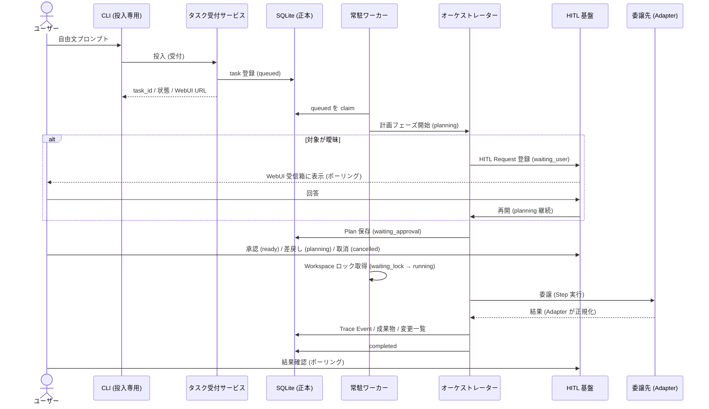
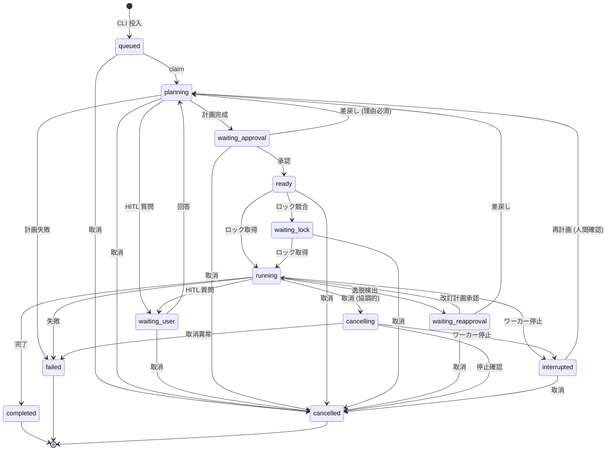

# Task Agent MVP 仕様

Status: Draft (MVP spec, implementation not started)

関連文書:

- 文書群の入口: [README.md](README.md)
- 用語定義: [../../CONTEXT.md](../../CONTEXT.md)
- 判断記録: [adr/](adr/) および [ai_wiki/00-Index.md](../../ai_wiki/00-Index.md)

## 1. 目的・非目的

### 目的

- AI Hub と人間の間で依頼を理解・分解・中継する、**単一のタスクオーケストレーター**を提供する。
- CLI からの自由文プロンプト投入を MVP の入口とし、投入直後にタスク ID・受付状態・WebUI URL を返す。
- 以後の確認・承認・差戻し・取消は WebUI の HITL で行う。
- 実タスクの高度な完遂品質より、**状態遷移・HITL・監査・停止と再開の完全性**を優先する。

### 非目的 (MVP 外)

- 認証・役割管理（単一ローカルユーザー前提）
- Inbox 投入入口・定期実行入口（将来拡張。ただし受付サービスは共通化する。§15）
- 外部通知（LINE 通知等）・リアルタイム通知（WebUI ポーリングのみ）
- ステップ数・時間・LLM 呼出し回数・コストの一律上限（§11 のリスクを参照）
- 自動ロールバック（§9）
- コーディング CLI のサンドボックス保証（§10 の制約を参照）
- 承認時スナップショットと実行時対象状態の一致保証（§7.4）
- 観測可能な思考過程（LLM の非公開思考過程）の保存

## 2. ユースケース

| # | ユースケース | 主体 | 概要 |
| --- | --- | --- | --- |
| U1 | タスク投入 | ユーザー (CLI) | 自由文を投入し、タスク ID・状態・WebUI URL を即時受け取る |
| U2 | 計画確認・承認 | ユーザー (WebUI) | 受信箱で計画を確認し、一括承認する |
| U3 | 質問への回答 | ユーザー (WebUI) | 対象が一意に特定できない等の質問に回答する |
| U4 | 計画差戻し | ユーザー (WebUI) | 理由を必須で入力し、同じタスク ID のまま再計画させる |
| U5 | タスク取消 | ユーザー (WebUI) | 実行前後のタスクを取消する（実行中は協調的取消） |
| U6 | 進捗・結果確認 | ユーザー (WebUI) | 状態・計画・トレース・成果物・変更一覧を閲覧する |
| U7 | 依頼の理解・分解 | オーケストレーター | 自由文を解析し実行計画を作る。対象が曖昧なら HITL で質問する |
| U8 | 委譲実行 | オーケストレーター | Capability Manifest に基づき専門エージェント／コーディング CLI へ委譲する |
| U9 | 停止後の復旧判断 | ユーザー (WebUI) | 中断タスクのトレースを確認し、再計画・再承認する |

## 3. E2E シーケンス



## 4. CLI 投入契約

- 入口は CLI の自由文プロンプト投入のみ。CLI は対話・確認・承認を行わない。
- 具体的なコマンド名・フラグは未決事項 (§16.1)。仮称として `python -m obsidian_ai_hub --task "..."` を用いる。
- 投入直後に以下を返す（実行を待たない）:
  - `task_id`
  - 受付状態（`queued`）
  - WebUI URL（タスク詳細ページ）
- 投入失敗時（自由文が空等）はエラーを返し、タスクを生成しない。

## 5. WebUI 要件

- **タスク受信箱**: 自分宛ての HITL Request（質問・計画承認・再承認）を一覧表示する。ポーリングで更新する。
- **タスク詳細**: 状態、計画（現在版と履歴）、質問と回答、承認・差戻し理由、取消、トレース、成果物、変更一覧を表示する。
- **操作**: 質問回答、計画承認、理由付き差戻し、タスク取消。
- **差戻し**: 理由入力が必須。理由が空の差戻しは送信不可。
- 既存 WebUI（FastAPI + React）に画面を追加する形とする。認証は既存 Web の方針に従う（MVP で新たな役割管理はしない）。

## 6. 常駐ワーカー

- AI Hub 内の常駐ワーカーが SQLite をポーリングし、実行可能なタスクを非同期に処理する。
- 既存の常駐 HITL ワーカー（launchd, `--hitl-worker`）および runs manager のインスタンスロック方式に倣う。
- 起動時リカバリ: 前インスタンスが所有していた非終端タスクを `interrupted`（中断）にする。既存 `runs/manager.py` の `startup_recovery` と同じ方針。
- シャットダウン時: 実行中タスクを `interrupted` にする。**再起動後に自動再実行しない。**
- 異なる Workspace のタスクは並列実行可能。同一 Workspace への書込みは排他ロック (§8)。

## 7. 計画と HITL

### 7.1 計画

受付後、オーケストレーターがタスクを理解・分解して実行計画を作る。計画には最低限以下を含める:

- 目的
- 手順（ステップ列）
- 使用ツールまたは委譲先
- 対象（Workspace / ファイルパス等）
- 想定変更・副作用（**削除を含む場合は対象と効果を明記する**）
- 完了条件

### 7.2 承認

- タスク全体の計画を WebUI で**一括承認**する（ステップ単位の承認はしない）。
- 人間は以下を実行できる: 質問への回答、計画承認、理由付き差戻し、タスク取消。
- 差戻し理由は必須。差戻しは同じタスク ID のまま再計画 (`planning`) へ戻し、再承認へ回す。

### 7.3 逸脱

- 承認済み計画からの逸脱が必要になった場合、オーケストレーターは実行を停止し、改訂計画を作って再承認 (`waiting_reapproval`) を求める。
- 無断逸脱は禁止。逸脱検知の厳密な機械判定は MVP ではオーケストレーターの自己申告＋トレース監査に頼る（未決事項 §16.5）。

### 7.4 最新状態

- 承認後に対象（Vault・リポジトリ・ファイル）の最新状態が変わっていても、MVP では**最新状態に対してそのまま実行する**。
- 承認時スナップショットとの一致保証はしない。このリスク（承認時と実行時の乖離による意図しない変更）を運用で受容する。

## 8. 対象解決とロック／並行実行

### 8.1 Workspace 解決規則

1. 自由文から対象が一意に特定できる場合:
   - **Vault**: `config.yml` に登録された Vault（単一 Vault 前提）。
   - **Git リポジトリ**: 既存の確定済みプロジェクトのうち、**有効な `project_path` を持つ**もの。既存 `coding.backend.validate_git_repo` で Git ルートへ正規化する。
   - 未解決候補 (`project_candidates`) やパスなし (`project_path` が NULL/空) のプロジェクトは**対象外**。
2. 自由文から対象を一意に特定できない場合、オーケストレーターは**勝手に選ばず**、WebUI の HITL で質問する (`waiting_user`)。
3. 対象なし（Vault 全体の参照等）のタスクもあり得る。この場合 Workspace ロックは Vault を単位とする。

### 8.2 ロックと並行実行

- 異なる対象のタスクは並列実行可能。
- 同じ Workspace への**書込みは排他ロック**。読取同士は並列可能。
- ロック待ちのタスクは `waiting_lock` 状態となり、ロック解放後に `running` へ進む。
- ロックの実装（DB テーブル／インプロセス管理）は未決事項 (§16.3)。
- Vault と登録済み Git リポジトリには**共通権限**を適用する: 読取・作成・編集・削除・コマンド実行が可能。
- **削除**は、実行計画へ対象と効果が明記されている場合、通常の一括計画承認で許可される（削除専用の追加承認はしない）。

## 9. 障害・取消・再起動復旧

### 9.1 リトライ

- ツールの自動リトライは、Capability Manifest／Adapter が宣言する「再試行可否・最大回数・間隔」の範囲だけで行う。
- 宣言範囲を超えるリトライはしない。解決しなければ停止し、原因と再開案を HITL（WebUI）へ返す。
  復旧に人間の判断が必要な場合は `failed`、人間への質問で継続できる場合は `waiting_user`
  （いずれも §13.1 の `running` からの許可遷移に含まれる）。

### 9.2 中断と復旧

- 常駐ワーカー停止時に実行中だったタスクは `interrupted`（中断）とする。
- **再起動後に自動再実行しない。** 二重実行防止のため、人間がトレースを確認して再計画・再承認する。
- `interrupted` からの遷移は `planning`（人間が確認済みの再計画）または `cancelled` のみ。`running` への直接遷移は禁止。

### 9.3 取消（協調的取消）

- 実行中タスクの取消は協調的取消: `cancelling` へ遷移し、
  - 新しいステップを開始しない
  - 実行中ツールへ中止要求を送る
  - 途中変更をトレースへ記録する
- 取消は**ロールバックを意味しない**。実施済み変更は残る。
- 実行前（`queued`〜`ready`）の取消は即時に `cancelled` へ遷移できる。

### 9.4 失敗時

- 途中失敗時も**自動ロールバックしない**。
- 実施済み変更、未実施手順、復旧案を記録して HITL（WebUI）へ返す (`failed`)。

## 10. セキュリティ／信頼境界

- Vault・Git リポジトリ・ツール出力中の文章は**命令ではなく、常に信頼できないデータ**として扱う（間接プロンプトインジェクション対策）。
- 命令源は次の 3 つだけ:
  1. ユーザー依頼（CLI 投入の自由文）
  2. WebUI の HITL 回答
  3. 登録済みシステムポリシー
- 秘密管理は既存 AI Hub および各コーディング CLI の仕組みを利用する。
- タスク DB・プロンプト・実行トレースへ**秘密値を保存しない**。構造化トレースでは機密値を redact する。
- **明示的な制約・リスク**: コーディング CLI の対象外パス作用や削除禁止を、親オーケストレーター側では技術的に保証しない。
  実権限は CLI 固有設定（`config.yml` の `coding.cli` 等）を信頼する。親側のサンドボックス保証は MVP では行わない。
  このため、委譲先 CLI が計画外の作用を行う残存リスクを受け入れる
  （[ADR: Workspace 解決とコーディング CLI の信頼境界](adr/workspace-resolution-and-coding-cli-trust-boundary.md)）。

## 11. 実行モデルと上限

- オーケストレーター = LLM ツール呼出しループ ＋ アプリケーション側の永続状態機械。
- タスク状態の正本は SQLite（[ADR: SQLite をタスク状態の正本とする](adr/sqlite-as-task-state-source-of-truth.md)）。
- **MVP ではステップ数・時間・LLM 呼出し回数・コストの一律上限を設けない。**
  - リスク: ループに陥ったタスクが LLM コストと実行時間を消費し続け得る。検知はトレース監査（人間の閲覧）に頼る。
  - 対応: 取消はいつでも WebUI から可能。上限導入は将来課題とする。

## 12. 能力と委譲

- オーケストレーターの能力:
  - Vault 検索・読取・分析・ノート作成・編集・削除
  - 登録済み専門エージェントへの委譲
  - コーディング CLI への委譲
- 利用可能なツール／専門エージェントは**登録済み Capability Manifest** から認識する。
- Manifest は少なくとも次を表現する: 名前、説明、入力仕様、必要権限、アダプター種別、リトライ方針。
- 委譲先ごとに**固有の入出力アダプター**を持つ。
- 親オーケストレーターは各アダプターの結果を親タスクの状態・成果物・トレースへ正規化する。
- **一律の共通レスポンスを委譲先へ強制する設計ではない**（委譲先の自然な出力を Adapter が親側へ正規化する方向）。

## 13. 状態モデル

状態名は既存コード規約（coding store の snake_case 状態）に合わせる。

| 状態キー | 日本語 | 種別 |
| --- | --- | --- |
| `queued` | 受付 | 非終端 |
| `planning` | 計画中 | 非終端 |
| `waiting_user` | 確認回答待ち | 非終端 |
| `waiting_approval` | 承認待ち | 非終端 |
| `ready` | 実行待ち | 非終端 |
| `waiting_lock` | リソース／ワークスペースロック待ち | 非終端 |
| `running` | 実行中 | 非終端 |
| `waiting_reapproval` | 再承認待ち | 非終端 |
| `cancelling` | 協調的取消処理中 | 非終端（過渡） |
| `interrupted` | 中断 | 非終端 |
| `completed` | 完了 | 終端 |
| `failed` | 失敗 | 終端 |
| `cancelled` | 取消 | 終端 |

### 13.1 状態遷移表

| From | To | 遷移契機 |
| --- | --- | --- |
| `queued` | `planning` | ワーカーがタスクを claim |
| `queued` | `cancelled` | ユーザー取消（claim 前） |
| `planning` | `waiting_user` | オーケストレーターが HITL 質問を登録 |
| `planning` | `waiting_approval` | 計画完成 |
| `planning` | `failed` | 計画生成の不可逆的失敗 |
| `planning` | `cancelled` | ユーザー取消 |
| `waiting_user` | `planning` | HITL 回答の到着（再開） |
| `waiting_user` | `cancelled` | ユーザー取消 |
| `waiting_approval` | `ready` | 計画承認 |
| `waiting_approval` | `planning` | 理由付き差戻し（再計画） |
| `waiting_approval` | `cancelled` | ユーザー取消 |
| `ready` | `waiting_lock` | Workspace ロック競合 |
| `ready` | `running` | ロック取得（競合なし） |
| `ready` | `cancelled` | ユーザー取消 |
| `waiting_lock` | `running` | ロック取得 |
| `waiting_lock` | `cancelled` | ユーザー取消 |
| `running` | `waiting_user` | 実行中の HITL 質問 |
| `running` | `waiting_reapproval` | 計画逸脱の検出（停止＋改訂計画） |
| `running` | `completed` | 完了条件の達成 |
| `running` | `failed` | リトライ枯渇等の失敗 |
| `running` | `cancelling` | ユーザー取消（協調的取消開始） |
| `running` | `interrupted` | ワーカー停止 |
| `waiting_reapproval` | `running` | 改訂計画の承認（実行再開） |
| `waiting_reapproval` | `planning` | 理由付き差戻し（再計画） |
| `waiting_reapproval` | `cancelled` | ユーザー取消 |
| `cancelling` | `cancelled` | 中止要求の完了・実行中ツールの停止確認 |
| `cancelling` | `failed` | 取消処理中の異常 |
| `cancelling` | `interrupted` | 取消待ち中のワーカー停止 |
| `interrupted` | `planning` | 人間がトレース確認のうえ再計画を指示 |
| `interrupted` | `cancelled` | ユーザー取消 |

### 13.2 状態図



### 13.3 禁止遷移（例）

- 終端状態 (`completed` / `failed` / `cancelled`) からの全遷移
- `queued` → `running`（計画と承認を経ずに実行しない）
- `interrupted` → `running`（自動再実行しない。必ず再計画・再承認を経る）
- `ready` / `waiting_lock` / `running` → `planning`（実行系に入った後は差戻しでなく取消または逸脱停止を使う）
- `waiting_approval` → `running`（承認後は必ず `ready` を経る）

## 14. 記録（監査）

タスクごとに以下を記録する。正本は SQLite 上の構造化イベント。

- 結果要約
- 変更一覧（実施済み変更）
- 実行トレース（Trace Event）
- 成果物（Artifact）
- 状態遷移
- ツール呼出し
- 委譲記録（委譲先・入力要約・結果要約）
- エラーとリトライ
- HITL の質問・回答・承認・差戻し理由・取消

制約:

- トレースの機密値は redact する。タスク DB・プロンプト・トレースへ秘密値を保存しない。
- LLM の非公開思考過程は保存対象にしない。
- **全入出力を無条件に保存する仕様にはしない**（要約・参照・redact の方針で保存量を制御する。詳細な保存閾値は未決事項 §16.6）。
- 保持期限は既存の実行ログ 30 日ポリシーに倣うか別途定めるかは未決事項 (§16.7)。

## 15. 将来入口との共通化

- Inbox 投入入口と定期実行入口は、CLI と**同じタスク受付サービス**を利用できる設計にする。
- 受付サービスは「自由文＋任意メタデータ → task 登録 → (task_id, 状態, WebUI URL) 返却」の契約を持つ。
- 入口ごとの差分（起動元、通知方針）は受付サービスの外側で吸収する。

## 16. 未決事項

1. **CLI コマンド名・フラグ**: 仮称 `--task`。確定は実装時。
2. **テーブル名・マイグレーション番号**: 概念データモデルは §17。実際の `PRAGMA user_version` とテーブル名は実装時に決める。既存 `task_state`（定期コマンド集計用）との名前衝突に注意。
3. **Workspace ロックの実装**: DB テーブルによるロックか、インプロセス管理か。単一ワーカー前提なら後者でも足りる。
4. **Capability Manifest の保存形式**: 既存 `agents` テーブル／ツールレジストリとの統合方法（新テーブルか、既存への拡張か）。
5. **逸脱検知の機構**: オーケストレーター自己申告＋トレース監査で足りるか、機械的な計画照合を入れるか。
6. **トレースの保存閾値**: 何を全文保存し何を要約するか。
7. **トレース保持期限**: 既存 30 日ポリシーとの関係。
8. **既存 HITL の LINE 通知誘導との関係**: Task Agent は WebUI ポーリングのみ。既存 HITL v1（LINE→Web フォーム誘導）を Task Agent 向けに使うかは未決。
9. **WebUI URL のパス設計**: タスク詳細ページのルーティング。
10. **既存 coding ワークスペースとの session 共有**: 委譲先 CLI セッションを coding workspace のセッションとして可視化するか。

## 17. SQLite 概念データモデル

実装未確定。テーブル名・列名は概念レベルの表記。

```
tasks
  task_id (PK)
  source            -- 'cli' (将来: 'inbox' / 'schedule')
  prompt_text       -- ユーザー依頼 (自由文)
  status            -- §13 の状態キー
  created_at / updated_at / started_at / finished_at
  error_summary
  result_summary

task_plans
  plan_id (PK)
  task_id (FK)
  version           -- 改訂ごとに加算。タスク ID は不変
  purpose / steps_json / tools_json / targets_json
  expected_changes_json   -- 削除を含む副作用の明記
  completion_criteria
  status            -- draft / approved / rejected / superseded
  rejection_reason  -- 差戻し理由 (必須制約はアプリ層で強制)
  created_at / decided_at

task_hitl_links
  link_id (PK)
  task_id (FK)
  hitl_run_id (FK)  -- 既存 hitl_runs への参照
  kind              -- question / plan_approval / reapproval
  created_at / resolved_at

task_delegations
  delegation_id (PK)
  task_id (FK)
  capability_id (FK)
  step_ref
  input_digest      -- 秘密値を含まない入力要約
  outcome_summary
  status
  created_at / finished_at

task_events            -- Trace Event (追記のみ)
  event_id (PK)
  task_id (FK)
  seq
  event_type           -- state_transition / tool_call / delegation /
                       -- hitl / error / retry / artifact
  payload_json         -- 機密値は redact 済み
  created_at

task_artifacts
  artifact_id (PK)
  task_id (FK)
  kind              -- summary / change_list / file_ref
  content_or_ref
  created_at

capabilities
  capability_id (PK)
  name (UNIQUE)
  description
  input_spec_json
  required_permissions_json
  adapter_type          -- vault / specialist_agent / coding_cli
  retry_policy_json     -- 再試行可否 / 最大回数 / 間隔
  enabled
  created_at / updated_at

workspace_locks (概念。実装は未決事項 §16.3)
  workspace_key (PK)    -- vault または 正規化済み git ルートパス
  task_id
  mode                  -- write (排他) / read (共有)
  acquired_at
```

既存テーブルとの関係:

- `projects` (v9): `project_path` が有効な確定済みプロジェクトのみ Workspace 候補。
- `hitl_runs` / `hitl_questions` (v13/15): HITL Request の格納基盤として再利用。
- `agents` / `agent_runs` (v21+): 専門エージェント委譲の実行基盤候補。
- `coding_*` (coding store): コーディング CLI 委譲の実行基盤候補。

## 18. 受入基準

1. CLI で自由文を投入すると、即時に `task_id`・受付状態・WebUI URL が返る。
2. 投入されたタスクは `queued` で SQLite に登録され、常駐ワーカーが claim して `planning` へ進む。
3. 対象が一意に特定できない依頼は、勝手に実行されず WebUI に質問が現れる。
4. 計画には目的・手順・ツール／委譲先・対象・想定変更・完了条件が表示され、承認なしでは実行が始まらない。
5. 差戻しは理由なしに送信できず、同じタスク ID のまま再計画される。
6. 実行中の同一 Workspace への書込みタスクは排他され、`waiting_lock` で待つ。
7. ワーカー停止で実行中タスクは `interrupted` になり、再起動しても自動再実行されない。
8. 実行中の取消は協調的取消で動作し、途中変更がトレースに記録される。ロールバックは発生しない。
9. トレースには状態遷移・ツール呼出し・委譲・HITL・エラーとリトライが記録され、秘密値が現れない。
10. すべての状態遷移が §13.1 の表に従い、表外の遷移は拒否される。

## 19. 移行課題（既存実装との関係）

- 既存 `runs/manager.py` の startup/shutdown recovery は coding / agent run を対象としており、Task Agent のタスクには未対応。タスク受付時に同じ機構へ登録する必要がある（実装課題）。
- 既存 coding store の状態集合 (`queued/running/cancelling/waiting_user/completed/failed/cancelled/interrupted`) と本仕様の状態集合は似るが別物。混同しないこと。変換は Adapter 層で行う。
- 既存 HITL の一部フローは LINE 通知で Web フォームへ誘導する。Task Agent はこれを使わない (§16.8)。
