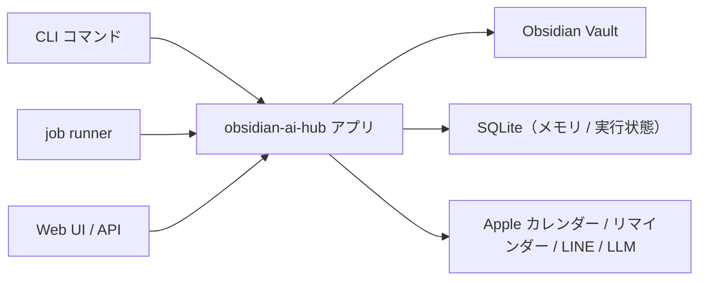

# obsidian-ai-hub とは

obsidian-ai-hub は、Obsidian のデイリーノート運用を自動化するための、ローカルで動くツールキットです。
大きく分けて次の 3 つの入口があります。

| 入口 | 役割 |
| --- | --- |
| **CLI** (`uv run -m obsidian_ai_hub ...`) | 1 回限りの処理（Inbox 取込、サマリ生成、バックアップ、同期など）を実行する。 |
| **Web UI** (`http://127.0.0.1:8765`) | メモリのレビュー、Task Agent、ワークフロー、ジョブ管理、承認待ち（HITL）などを操作する。 |
| **ジョブ実行（job runner）** | `jobs/jobs.local.yml` のスケジュールに従い、CLI コマンドを定期的に起動する。 |

## 主な機能

- **Inbox とデイリーノート** — Inbox に保存したメモ・音声・Web クリップ・YouTube などをデイリーノートへ取り込み、今日の目標を生成する。
- **サマリ** — 日次・週次・月次のサマリを生成し、Web UI のサマリダッシュボードで閲覧・編集する。
- **予定とリマインダー** — Apple カレンダー / リマインダーの予定を今日のノートへ書き出し、LINE へ通知する。AI プランナー提案も生成する。
- **リサーチ** — テーマを指定して調査し、結果を Vault に保存する。テーマ候補の提案も行う。
- **長期メモリ** — ノートから抽出した候補を人間がレビューして承認し、生成処理の文脈として再利用する。
- **AI エージェント / コーディング** — 汎用 AI エージェントとの会話と、OpenCode ACP によるコーディング支援。
- **Task Agent / ワークフロー** — 自由文の依頼を計画・承認つきで実行する Task Agent と、GUI で設計する Node / Edge グラフのワークフロー。
- **ジョブ管理 / 実行ログ** — 定期実行とワンショットのジョブを管理し、実行ログとジョブ状態を確認する。

## 全体像

- **Vault** — ノートやサマリの保存先。`VAULT_PATH` で指定する。
- **SQLite** — 承認待ち、長期メモリ、Task、ワークフロー、実行ログなどの状態を保持する。
- **外部連携** — LLM プロバイダ、Apple カレンダー / リマインダー、LINE など。

## 次に読む

- 使い始める: [インストール](installation.md)
- 起動して画面を開く: [サーバーと Web UI](web-ui.md)
- 日々のコマンド: [CLI の基本](../daily/cli-basics.md)
