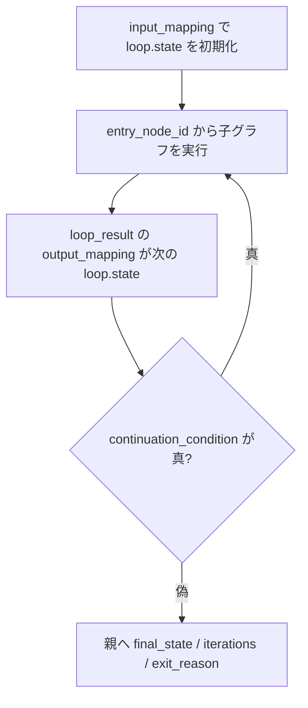

# データの受け渡し

Node 間のデータ連携は、文字列のテンプレート展開ではなく **型付き参照** だけで行います。
参照は `{"$ref": "<path>"}` の形で書き、リテラル値はそのまま渡ります。

## 参照できるパス

| 参照 | 意味 | 使える場所 |
| --- | --- | --- |
| `run.inputs.<field>` | Run 開始時の入力値 | 全体 |
| `run.context.reference_time` | Run 作成時に固定された基準時刻（date-time） | 全体 |
| `nodes.<node_id>.output.<field>` | 先行 Node の出力 | 同一スコープ内 |
| `loop.state.<field>` | Loop の現在の反復状態 | Loop 子グラフ内のみ |
| `loop.input.<field>` | Loop の初期入力（`input_mapping`） | Loop 子グラフ内のみ |
| `loop.iteration` | Loop の反復番号 | Loop 子グラフ内のみ |

例:

```json
{
  "relative_path": {"$ref": "run.inputs.output_path"},
  "content": {"$ref": "nodes.plan_node.output.plan"}
}
```

Capability Node の出力は、型が宣言されているもの（読み取り/検索系、`hitl_wait`、`research_agent`、
`register_*_job` など）は `nodes.<node_id>.output.<field>` を参照できます。宣言のない Capability は
`nodes.<node_id>.output` 全体（要約 `summary`、または JSON object 全体）のみ参照できます。

## 解決のタイミング

1. **静的検証** — 参照が解決可能で、スコープ規則に合うかを確認します。
   - `nodes.<node_id>.output.*` は同一スコープの Node だけを参照できます。
   - `run.inputs.<field>` は `inputs_schema.properties` に存在する必要があります。
   - `loop.*` は Loop 子グラフ内でのみ有効です。
2. **実行直前** — 参照を実際の値へ解決し、Pydantic / JSON Schema で完全に検証します。

参照が未解決、または schema に合わない場合、Node は実行されず失敗します。
動的検証エラー（参照未解決・schema 不一致）は再試行されません。

## 日時式（`$expr`）

「今日」「今週の月曜〜日曜」のような実行時の日付は、`{"$expr": ...}` で書きます。値の位置
（Capability / Agent の `inputs`、Loop の `input_mapping` / `output_mapping`、Run 入力）で
リテラルの代わりに使えます。フォームの「式」ボタンから入力できます。

```json
{
  "$expr": {
    "kind": "date_math",
    "version": 1,
    "anchor": "now",
    "math": "/w+6d",
    "timezone": "Asia/Tokyo",
    "week_starts_on": "monday",
    "result": "date"
  }
}
```

- `anchor` は `"now"`（基準時刻）または date / date-time 型の参照です。
- `math` は左から順に適用する演算列です。単位は `y M w d h m s`（大文字小文字を区別）。
  - `-1d` … 1 日前、`+2h` … 2 時間後
  - `/w` … 週の先頭へ切り下げ、`/M` … 月初へ切り下げ、`/d` … 0 時へ切り下げ
  - `/w+6d` … 週の先頭から 6 日後（月曜始まりなら日曜）。例として `calendar_read` の
    終了日に渡せます。
- `timezone`（既定 `Asia/Tokyo`）と `week_starts_on`（既定 `monday`）は式ごとに変更できます。
- `result` は `date`（`YYYY-MM-DD`）または `datetime`（オフセット付き ISO 8601）です。

日時式の基準時刻は **Run ごとに一度だけ固定** されます。

| Run の種類 | 基準時刻 |
| --- | --- |
| 手動実行 | Run を作成した時刻 |
| 定期 Scheduler | 発火枠（`scheduled_for`） |
| one-shot | 実行予定時刻（`run_at_utc`） |
| Rerun | 新しい作成時刻 |
| 再開・retry | 保存済みの基準時刻を再利用 |

## 日付のスキーマ（`format`）

JSON Schema の `format` に `date` / `date-time` を指定できます。フォームは日付入力として
表示し、値の形式を検証します。`$expr` の `result` は配置先の `format` と一致させてください
（`date` には `result: "date"`、`date-time` には `result: "datetime"`）。

## パイプ（`pipe`）

参照先の値を入力境界で軽く加工したいときは、`$ref` に `pipe` を付けます。エディタでは参照の
下に演算子エディタが表示され、順序変更・引数編集ができます。

```json
{
  "$ref": "nodes.<node_id>.output.events",
  "pipe": [
    { "op": "slice", "args": { "limit": 5 } },
    { "op": "pluck", "args": { "key": "title" } },
    { "op": "join", "args": { "sep": "\n" } },
    { "op": "truncate", "args": { "max_len": 500 } }
  ]
}
```

| op | 対象 | 引数 |
| --- | --- | --- |
| `upper` / `lower` | 文字列 | なし |
| `truncate` | 文字列 | `max_len`（文字数、省略記号なし） |
| `slice` | 文字列 / 配列 | `limit`、`offset`（任意） |
| `replace` | 文字列 | `frm`、`to`（任意） |
| `pluck` | object 配列 | `key`（要素に無ければ失敗） |
| `join` | 配列 | `sep`（任意。object は JSON 化） |
| `default` | 任意 | `value`（`null` / `""` / `[]` のとき置換） |

- 演算子は左から順に適用されます。
- 型が合わない・`pluck` のキーが無い場合は **その Node が失敗**し、error Edge があれば
  そちらへ進みます。Capability / Agent は呼び出されません。
- `$expr` にはパイプを付けられません。日時式を文章に含めるときは「テキスト組立」Node の
  `inputs` から参照します。

## テキスト組立（text_template）

複数値から文章を作るときは **テキスト組立** Node を使います（[Node リファレンス](nodes.md#text_template-nodeテキスト組立)）。
出力は常に `nodes.<node_id>.output.text`（string）です。

## 分岐（条件付き Edge）

Edge は `condition` オブジェクトを持てます。

```json
{
  "from_path": "nodes.review.output.approved",
  "operator": "equals",
  "value": true
}
```

| operator | 内容 | `value` |
| --- | --- | --- |
| `equals` | 参照値と `value` が等しい | 必須 |
| `exists` | 参照値が `null` でない | 不要 |
| `in` | 参照値が配列 `value` に含まれる | 必須（配列） |

- source Node の outgoing Edge を `order_index` 順に評価し、最初に真になった 1 本だけを通ります（排他的）。
- どの条件も真にならず、条件なし（常に真）の Edge もない場合、Run は `failed` になります。
- 分岐で選ばれなかった Node は `skipped` になります。

条件は **Edge 一覧** の **条件** から編集できます（`from_path` は参照ピッカーで選択）。
Loop の `continuation_condition` も同様の条件エディタで編集します。

## 合流（OR 合流）

複数の source Node から同じ target Node へ Edge を張れます。
target Node は最初に到達した経路で一度だけ実行されます。並列実行は行いません。

## Loop 内のデータフロー



- 各反復の開始時に子グラフを `entry_node_id` から実行します。
- 子グラフ内の Node は `loop.state` / `loop.input` / `loop.iteration` を参照できます。
- `loop_result` の `output_mapping` が次の `loop.state` になります。
- `continuation_condition` が真の間、`max_iterations` まで反復します。
- 反復ごとに Activation が新規作成されます（retry 時は同一 Activation を再利用）。

## 次に読む

- [Run・承認・復旧](runs.md)
- [テンプレート](templates.md)
