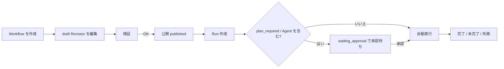

# ワークフロー（グラフ実行）

ワークフローは、人間が Web UI で設計する **Node / Edge グラフ** です。
制御とデータフローは決定的に実行され、Agent Node の LLM 出力は JSON Schema で検証されて
型付きで後続 Node へ渡されます。

自由文をその場で LLM が解釈する [Task Agent](../features/task-agent.md) とは異なり、
ワークフローは「あらかじめ人間が設計した定型フロー」を繰り返し実行する用途に向いています。

## 向いている用途

仕様で想定されている代表例:

1. **機能追加の計画 → レビュー → 改稿 → 実行** — Planner が計画し、Reviewer の判定で改稿ループを回し、承認後に実行する。
2. **文脈付きリサーチ** — Vault / 活動 / 既存テーマを読み取り、テーマを整えてからリサーチを実行し、結果を保存する。
3. **定型タスクの承認付き自動化** — 人間が設計した Capability グラフを手動実行する。

## 入口

| 操作 | 場所 |
| --- | --- |
| 一覧・新規作成・テンプレートから作成 | [`/workflows`](/reference/web-ui-map) |
| Revision 履歴・最近の Run | `/workflows/:workflowId` |
| グラフエディタ | `/workflows/revisions/:revisionId/edit` |
| Run 詳細 | `/workflows/runs/:runId` |

API は `/api/v1/workflows/...` 配下で、他の API と同じ Bearer トークン認証を要求します。

## 基本の流れ

1. Workflow を作成すると、空の `draft` Revision が 1 つ作られます。
2. エディタで Node と Edge を組み、`inputs_schema` を定義します。
3. **検証** に合格したら **公開** します。公開した Revision は不変になります。
4. 実行入力を入れて **実行** します。`plan_required` の Capability か Agent Node を含む場合は
   `waiting_approval` になり、Run 詳細で **承認** するまで実行されません。
5. Run 詳細で進捗・Node 状態・出力・Event を確認します。

## Workflow の改名・削除

Workflow 詳細（`/workflows/:workflowId`）から本体を管理できます。

- **改名・説明の変更** — ヘッダーの「編集」で名前と説明を変更し「保存」します。名前は空にできません。
- **削除** — ヘッダーの「Workflow を削除」で確認後、Workflow 定義と実行履歴をまとめて削除します。
  次の場合は削除できません（先に解消してください）。
  - 実行中の Run（承認待ち・HITL 待ち・要確認待ちを含む終端していない Run）が残っている。
  - Scheduler Job の対象になっている。ジョブ側で対象を変更または削除してください。

削除は取り消せません。実行履歴も一緒に消えるため、残したい場合は削除しないでください。
個別の Revision（下書き・旧版）だけを消す場合は、Revision 行の「削除」を使います
（公開済み Revision は削除できません）。

## 関連ページ

- [用語と状態](concepts.md)
- [エディタの使い方](editor.md)
- [Node リファレンス](nodes.md)
- [データの受け渡し](data-flow.md)
- [Run・承認・復旧](runs.md)
- [テンプレート](templates.md)
- [制約とトラブルシューティング](limits.md)
