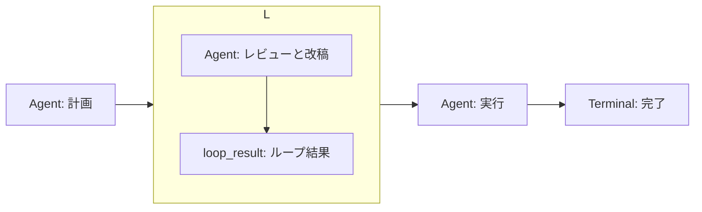
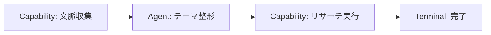

# テンプレート

**ワークフロー** 一覧の **テンプレートから作成** から、定義済みのグラフでワークフローを開始できます。
テンプレートはコードで定義されており、作成時に Node / Edge へ新しい UUID が割り当てられます。

API では次で取得・作成できます。

- `GET /api/v1/workflows/templates` — テンプレート一覧
- `POST /api/v1/workflows/from-template` — テンプレートから作成

:::warning[Agent Node には Agent を選択してください]
テンプレートの Agent Node は `agent_id` が空の状態で作成されます。
公開前に、エディタで対象の Agent を選択してください。
:::

## ユーザーテンプレート

自分で作った公開済み Revision を、再利用可能な **ユーザーテンプレート** として保存できます。
コード定義のテンプレートとは別枠で、**ワークフロー** 一覧の **ユーザーテンプレート** 領域に表示されます。

- **保存** — Workflow 詳細の公開済み Revision の行で **Template 保存** を押します。
  draft（下書き）は保存対象外です。
- **使って作成** — 一覧のユーザーテンプレートで **使って作成** を押すと、新しい Workflow と
  下書き Revision が作られ、エディタが開きます。Node / Edge には新しい ID が割り当てられます。
- **名前・説明の編集** — 一覧の **編集** から変更します。
- **内容の更新** — Workflow 詳細で対象のテンプレートを選び **内容を更新** を押すと、公開済み
  Revision の定義でテンプレートを置き換えます。過去にそのテンプレートから作成した Workflow は
  変更されません。
- **削除** — 一覧の **削除** はテンプレートの行だけを消します。作成済みの Workflow・Revision・
  Run・Scheduler Job は変更されません。
- **ダウンロード** — 一覧の **JSON** / **YAML** で定義をファイルに保存できます。

テンプレート利用では、実行・公開・Scheduler 登録は自動で行われません。エディタで内容を確認し、
必要なら Agent / Capability を直してから **検証** と **公開** を行ってください。

## JSON / YAML の import / export

Workflow の定義は **Workflow Definition Package v1** として JSON / YAML で持ち運べます。

- **export** — Workflow 詳細の公開済み Revision の行で **JSON** / **YAML** を押します。
  draft は export できません。
- **import** — **ワークフロー** 一覧の **JSON/YAML を import** でファイルを選びます。
  import は常に **新しい Workflow の下書き** を作り、既存の Workflow・Revision・Run は変更しません。

package に含まれるのは `format` / `version` / `name` / `description` / `inputs_schema` /
`nodes` / `edges` だけです。Workflow / Revision / Template の ID、状態、Run、Event、
Scheduler 設定は含まれません。Node / Edge の ID は package 内だけで通用し、import 時に
すべて新しい ID へ割り当て直されます。

インポート後は現在の環境の Capability / Agent で再検証されます。未知の Capability / Agent などが
あると、下書きと検証エラーが表示されるので、エディタで修正してから公開してください。
**import だけでは公開・実行は行われません。**

:::warning[秘密値を定義に含めないでください]
package は定義を平文で保存・共有します。API キーなどの秘密値は Node の入力や
`inputs_schema` に書かないでください。
:::

## 機能追加の計画→レビュー→改稿→実行

- `template_key`: `plan_review_execute`
- 入力: `task`（string、必須）

構成:

- **計画** Agent が `task` から計画（`plan`）を出力します。
- **改稿ループ**（`max_iterations: 4`）は、状態 `{plan, review, done}` を持ちます。
  - 子グラフの entry は **レビューと改稿** Agent。
  - `continuation_condition` は `loop.state.done equals false`。
  - **ループ結果** が `plan` / `review` / `done` を次の状態へ返します。
- ループ終了後、**実行** Agent が `nodes.loop.output.final_state.plan` を受け取り `summary` を出力します。
- **完了** Terminal（`success`）。

## 文脈付きリサーチ

- `template_key`: `contextual_research`
- 入力: `topic`（string、必須）

構成:

- **文脈収集** — Capability `research_context_snapshot` で活動・既存テーマ・Vault 検索の文脈を集めます。
- **テーマ整形** — `topic` と収集した `context` から、Agent が `theme` を出力します。
- **リサーチ実行** — Capability `research_agent` に `theme` を渡します。
- **完了** Terminal（`success`）。

## スターターテンプレートの位置づけ

スターターテンプレートはコード定義です。自分で作った公開済み Revision を再利用したい場合は
**ユーザーテンプレート** として保存してください。スターターテンプレートを土台に、エディタで
Node / Edge を調整して使うこともできます。

## 次に読む

- [制約とトラブルシューティング](limits.md)
