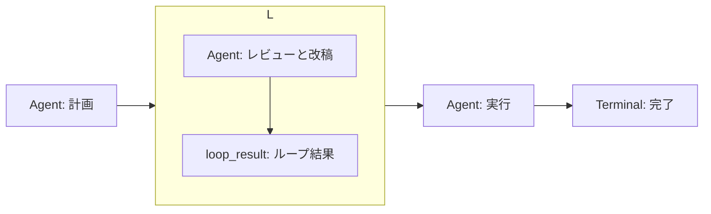
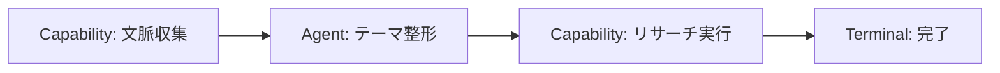

# テンプレート

**ワークフロー** 一覧の **テンプレートから作成** から、定義済みのグラフでワークフローを開始できます。
テンプレートはコードで定義されており、作成時に Node / Edge へ新しい UUID が割り当てられます。

API では次で取得・作成できます。

- `GET /api/v1/workflows/templates` — テンプレート一覧
- `POST /api/v1/workflows/from-template` — テンプレートから作成

:::warning[Agent Node には Agent を選択してください]
テンプレートの Agent Node は `agent_id` が空の状態で作成されます。
公開前に、エディタで対象の Agent を選択してください。
:::

## 機能追加の計画→レビュー→改稿→実行

- `template_key`: `plan_review_execute`
- 入力: `task`（string、必須）

構成:

- **計画** Agent が `task` から計画（`plan`）を出力します。
- **改稿ループ**（`max_iterations: 4`）は、状態 `{plan, review, done}` を持ちます。
  - 子グラフの entry は **レビューと改稿** Agent。
  - `continuation_condition` は `loop.state.done equals false`。
  - **ループ結果** が `plan` / `review` / `done` を次の状態へ返します。
- ループ終了後、**実行** Agent が `nodes.loop.output.final_state.plan` を受け取り `summary` を出力します。
- **完了** Terminal（`success`）。

## 文脈付きリサーチ

- `template_key`: `contextual_research`
- 入力: `topic`（string、必須）

構成:

- **文脈収集** — Capability `research_context_snapshot` で活動・既存テーマ・Vault 検索の文脈を集めます。
- **テーマ整形** — `topic` と収集した `context` から、Agent が `theme` を出力します。
- **リサーチ実行** — Capability `research_agent` に `theme` を渡します。
- **完了** Terminal（`success`）。

## スターターテンプレートの位置づけ

スターターテンプレートはコード定義です。JSON ファイルからのインポートやエクスポートは
v1 の対象外です。テンプレートを土台に、エディタで Node / Edge を調整して使ってください。

## 次に読む

- [制約とトラブルシューティング](limits.md)
